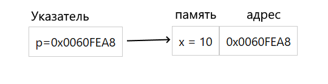

# Указатели

Каждый объект, который мы создаем в нашей программе, хранится в оперативной памяти. Оперативная, грубо говоря, это набор ячеек, где у каждой ячейки есть свой адрес и значение, которое оно в себе хранит. Адрес записан в шестнадцатеричном формате, например - `0000000198dff9c0`



`Указатель` - это объект, который ссылается на некоторую ячейку в памяти. Чтобы создать указатель, используется следующий синтаксис:

```c
// type *name;
// type *name = value;
int *pi;
double *pd;
float *pf;
```

## Операция взятия адреса

Эта операция позволяет узнать адрес желаемого объекта (переменной) и реализована символом `&`

```c
float value = 4.2;
float *pointerValue = &value;
```

## Операция разыменовывания (Dereference)

Эта операция позволяет узнать какое значени хранится под указателем. Т.е мы проходит по указанному адресу в указателе и забираем значение, которое там хранится. Реализован символом `*`

```c
int x = 5;              // initial value 5
int *pointerX = &x;     // some hex address
int valueX = *pointerX  // 5
```
